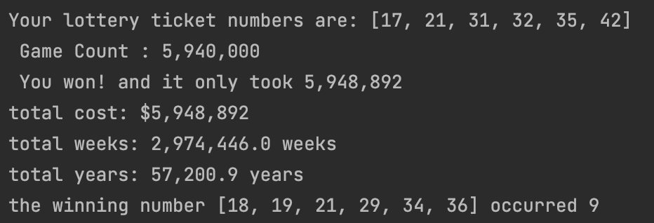

# Lottery Simulation 
### Sample output from console:

## How it works
This script generates a set of randomly generated numbers and compares it to a set of numbers the user has specified.

Can be used to input custom ranges of available numbers and custom set amount of numbers depending on what lottery you 
are playing. 

## Results
The script will output the amount of games played in realtime, incrementing by 1000.

The script will out the amount of games played, the amount of money spent on tickets, and the amount of time it would
take to win the lottery.

## How to customize the script
#### Change the range of numbers randomly generated:
Under the `pick_six `function, you will see a variable called `available_numbers`, that is where you will change the range
of numbers that you want the generator to choose from.

#### Change the amount of numbers generated on a "ticket:"
Under the `pick_six` function, you will find `for ticket_number in range(6):` and change
the integer inside to pick how many numbers will be on the "lottery ticket."

#### Change your lottery ticket numbers:
Find the list named `my_ticket_org`, you will change the numbers inside the list separated by commas.

#### Change output for calculating cost of games and time spent playing games:
In the while loop, find `total_cost = game_count * 1
        total_weeks = game_count / 2
        total_years = round(total_weeks / 52, 1)`. This is where you will define how much a ticket is, how many times 
a week you will play the game, and how many weeks in a year you will be playing the game.

#### Find duplicates and change amount needed to print to console:
Under the `counter` variable, you will find a key pair if statement. 
`if c > 8:`, you will change the integer of how many sublist need to match in the archive list to be
displayed to the console. 

